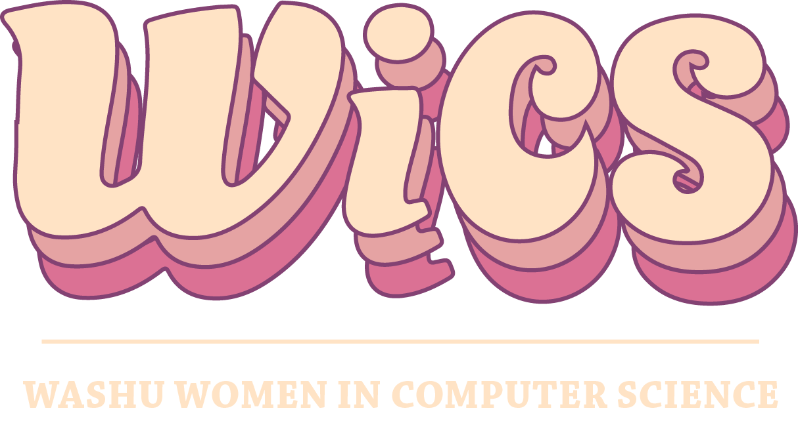

## Welcome to WashU WiCS

Washington University Women in Computer Science’s mission is to create a welcoming and supportive community for women in computing, bolster professional development by providing networking and mentorship opportunities, and inspire future generations of women by giving back to the greater St. Louis community.

### What We Do

- Here at WashU, our Women in Computer Science organization brings together women all across campus with an interest in technology. 
- WiCS hosts a variety of professional development events, including tech talks from top employers, company information sessions, and technical interview prep workshops.
- WiCS also connects members with exciting social events, like welcome-back socials, a WiCS&Mix outing, and a mentorship day.

### Executive Board

Welcome to our new WiCS Executive Board!
- President: Katie Lund
- Internal Vice President: Julia Dai
- External Vice President: Rachana Reddy
- Treasurer/Director of Finance: Priyanka Iyer 
- Director of Events: Katie Legan
- Director of Professional Development
- Director of Corporate Relations: Shruthi Ramalingam
- Director of Communications: Deepthi Kailash
- Co-Director of Marketing: Stephanie Chui
- Co-Director of Marketing: Olivia Kwon 

### Contact

- To contact WiCS, please email wics@su.wustl.edu.

## Current Announcements:
### GHC Application!

- The Grace Hopper Celebration (GHC) is a conference designed to bring the research and career interests of women in technology into the spotlight and is the largest gathering of women in computing. The conference consists of a combination of technical sessions and career sessions that fosters mentorship as well as networking. 

- This year, GHC will be Tuesday, September 29th, to Friday, October 2nd, in Orlando, FL. For more information, please visit the [AnitaB.org website](https://ghc.anitab.org/). WiCS will be sponsoring members to go to GHC on a scholarship!

- The WiCS GHC scholarship application is now closed. If you are still interested in GHC, please contact Katie Lund (kathleen.lund@wustl.edu). 

### GHC FAQ

- If you have more questions about GHC, take a look at the FAQ document **[HERE](https://docs.google.com/document/d/1ffBfKiZRechLM7BKk7BLEN716L6DTOvKGBE7l4zswmU/edit)!**

### GHC Zoom Panel

- If you were unable to attend the GHC Zoom Panel, view the recording **[HERE](https://drive.google.com/open?id=1M2t8wtYsM3W1l9eKdHDsu95HJ32WDJ5u)!** Panel content starts at around the 6 minute mark.
